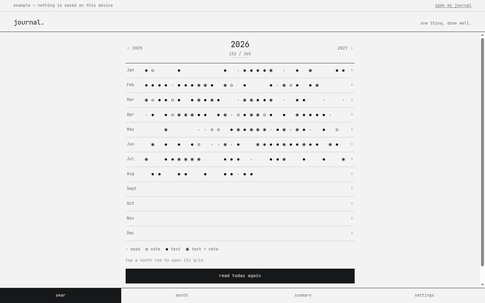
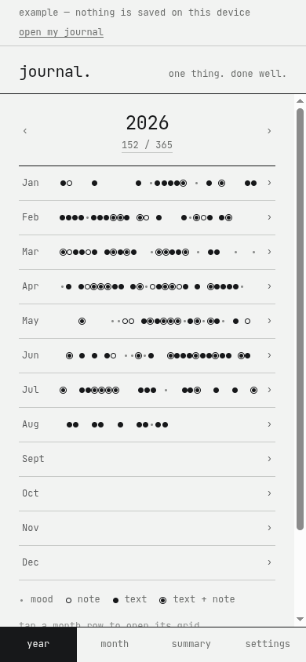
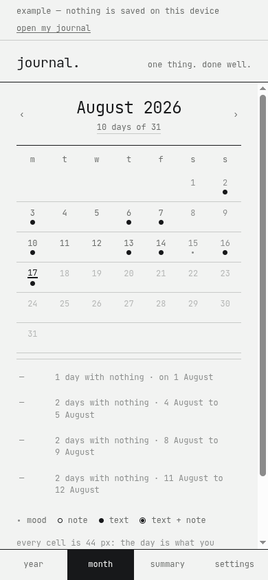
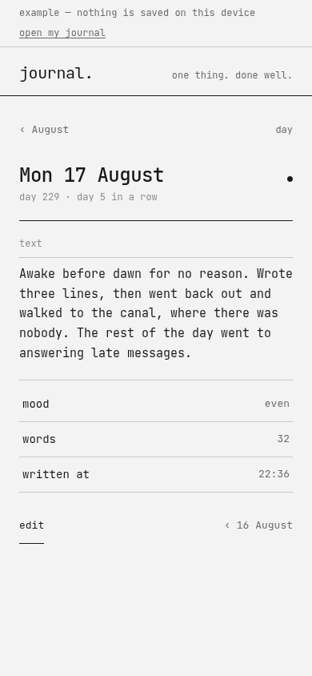
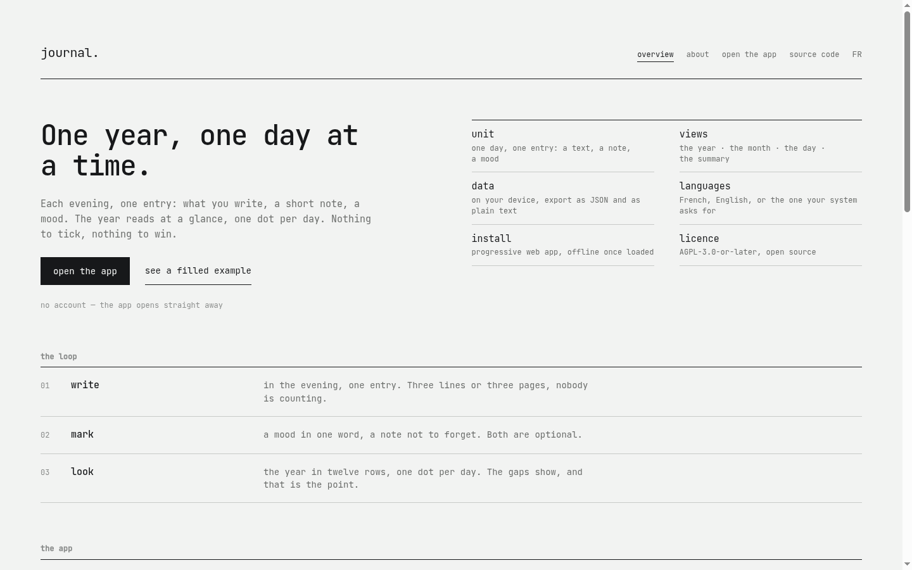

# journal.


**One year, one day at a time.**

journal. answers a single question: *what was that day like?* One entry per day — what you write, a short note, a mood — and a year that fills up one dot at a time. No reminder, no score, nothing reading over your shoulder.

No account, no network, no paid tier. Everything lives in your browser's local storage, and there are two ways out: a `journal.json` file you export and import yourself, and a plain-text file that reads without this program.

<picture>
  <source
    media="(prefers-color-scheme: dark)"
    srcset="docs/screenshots/app-desktop-dark.png">
  
</picture>

---

## Contents

- [What it is](#what-it-is)
- [What it is not](#what-it-is-not)
- [The four marks](#the-four-marks)
- [Why the whole year](#why-the-whole-year)
- [Screens](#screens)
- [Getting started](#getting-started)
- [Your data](#your-data)
- [Architecture](#architecture)
- [Design system](#design-system)
- [Accessibility](#accessibility)
- [Browser support](#browser-support)
- [Contributing](#contributing)
- [Licence](#licence)

## What it is

|  |  |
|---|---|
| **Unit** | one day, one entry: a text, a note, a mood, a place, a time |
| **Views** | the year · the month · the day · the summary |
| **Vocabulary** | `·` a mood · `○` a note · `●` text · `◉` text and note |
| **Data** | `localStorage`, `schemaVersion` 1, JSON export and import, plain-text export |
| **Languages** | French, English, or the one your system asks for |
| **Install** | progressive web app, works offline once loaded |
| **Licence** | AGPL-3.0-or-later |

Three depths, two gestures. The year is the page: twelve rows, one dot per day. Tap a month row and its grid opens. Tap a day cell and its text opens. That is the whole navigation.

The date is the identity of an entry, so there is exactly one per day, and a day you never wrote is not stored anywhere as empty: it is simply absent. A year you never opened costs nothing.

## What it is not

- no evening reminder, no notification, no nudge
- no mood average, no mood chart, no score
- no question of the day, no writing prompt, no imposed exercise
- no automatic summary, no sentiment analysis, nothing reading your entries
- no tag, no folder, no notebook, no rich text, no attachment
- no account, no sync, no sharing with anyone
- no tracker, no analytics, no advertising
- no emoji, anywhere

A day left unwritten is not a failure. It is a day left unwritten.

Two of those refusals are load-bearing and will not be reconsidered. **The evening reminder**: an app that demands its entry turns a journal into homework, and the day you write for the reminder rather than the wish, what you wrote is worth nothing. **Automatic analysis**: what you write does not have to be read by a program. That is also why there is no server: there is nothing to send it to.

The summary does count a current run of consecutive days, and a best run. That is a reading, not a chain to keep unbroken: it lives on the one screen you go to for it, nothing else mentions it, and nothing warns you when it stops.

## The four marks

A day carries one mark in the grids, the strongest one. Stacking three signs inside seven pixels does not read.

| Mark | Shape | The day carries |
|---|---|---|
| `·` | a dot | a mood, and nothing else |
| `○` | a ring | a note |
| `●` | a disc | text |
| `◉` | a ringed disc | text and a note |

A place qualifies an entry rather than being one, so it draws nothing. A day with only a place reads as empty, which is exact. There is nothing to read back.

The mark is never the only carrier. Every day cell in the month grid is a button named in full — "12 August 2026, text and note, open" — and the legend naming the four shapes sits under both grids permanently, not behind a tooltip.

## Why the whole year

A journal is kept over years, and what you want to see is not the latest entry: it is the shape of the whole. Twelve rows of thirty-one columns fit on a phone screen without shrinking anything into illegibility, because a day only ever needs seven pixels here. The detail lives one tap down, in the month.

That is also why the touch target is never the dot. Three pixels cannot be aimed at with a finger, so the month row carries the 44 px target and the dot is left to inform. The same rule holds in the month grid, where the cell is 44 px and the date is what you tap.

February stops at twenty-eight dots rather than faking three more, so the months stay aligned column by column and a short month looks short.

## Screens

| | |
|---|---|
|  |  |
| The year: twelve rows, one dot per day. | The month: 44 px cells, and the gaps folded below. |
|  |  |
| The day: the text first, the facts after. | The site, with the real app embedded. |

## Getting started

Node 20.19+ or 22.12+.

```bash
npm install
npm run dev        # http://localhost:5173
```

| Script | What it does |
|---|---|
| `npm run dev` | development server |
| `npm run build` | typecheck, then production bundle |
| `npm run preview` | serve the built bundle |
| `npm run typecheck` | `tsc --noEmit` |
| `npm test` | the whole suite, once |
| `npm run test:watch` | the suite, watching |
| `npm run icons` | regenerate the icons from the frozen outlines |

`/app?demo=1` opens the app filled with a year of invented entries, computed from today, without writing anything to the device. The example comes out of a fixed seed, so a screenshot stays valid between runs. It is the fastest way to see a change in context, and the only place a screenshot should ever come from.

## Your data

Everything is in `localStorage`, under the single key `journal.v1`, in exactly the format the export produces. What the app reads is what comes out of it:

```json
{
  "schemaVersion": 1,
  "data": {
    "entries": [
      {
        "date": "2026-08-12",
        "text": "Marché de bon matin, deux pêches trop mûres…",
        "note": "Rappeler Claire avant vendredi.",
        "mood": "clear",
        "place": "Paris 19ᵉ",
        "writtenAt": "22:14"
      }
    ]
  },
  "settings": {}
}
```

Moods are stored as one of four names — `clear`, `even`, `dense`, `low` — never as a number. They are not a scale: nothing in the app adds them up, and a file exported in 2026 stays readable by a vocabulary revised in 2030.

`writtenAt` is stamped once, at the first writing, and never moves again. It is the hour the day was told, not the hour it was last corrected.

**Export** downloads `journal-YYYY-MM-DD.json`. **Export as text** downloads one plain-text file, one entry per day, in the language of the interface. A journal must be readable without the program that wrote it. **Send to** hands the JSON file to the device's native share sheet when it can take one, and falls back to a download. **Import** validates the schema before anything is touched, then asks whether to merge or replace.

Merging never overwrites a day you have already written. Two devices that told the same 12 August did not write the same thing, and the program has no way to choose; it keeps what is there, counts what it added, and leaves replacing to you. A malformed entry is dropped on its own rather than failing the whole import.

Clearing the site data deletes everything, permanently. That is the trade for having no server. Export from time to time.

## Architecture

```
src/
├── lib/          pure logic — no React, no DOM, no window, no implicit clock
│   ├── types.ts      the model: Entry, Mood, Trace, Settings
│   ├── format.ts     dates in local time, never through UTC
│   ├── entries.ts    upsert, remove, word count, the mark of a day
│   ├── calendar.ts   the year in rows, the month in weeks, the gaps
│   ├── stats.ts      runs, counts, moods, the longest day
│   ├── io.ts         parse, serialise, merge, download, share, plain text
│   ├── storage.ts    the single localStorage key
│   └── sample.ts     the example year, computed from today out of a seed
├── state/        one store, persisted on every change
├── i18n/         fr.ts is the reference, en.ts its typed mirror
├── components/   the shared design-system components
├── app/          the app: year, month, day, summary, writing, settings
├── site/         the presentation site
└── styles/       tokens, base, components, app, site
```

`src/lib/` is pure by rule, which is why it carries most of the tests: the logic that can be wrong is tested without a browser. React in `lib/` means the logic is in the wrong place. So does an implicit clock: the day and the time are always passed in by the caller, which is what makes a run of consecutive days testable at all.

Dates are stored as `YYYY-MM-DD` and built from local date parts. Never `toISOString()`: it switches to UTC and moves every entry written after 22:00 to the next day anywhere east of Greenwich. That is the defect that matters most here, because people write in the evening. Day arithmetic goes through date components rather than milliseconds, so a daylight-saving change neither skips nor repeats a day.

`localStorage` rather than IndexedDB: two hundred words a day for ten years fit in a few megabytes, the API is synchronous — so there is no loading state on open — and the stored format stays the file format, readable by eye.

## Design system

The "famille ." 1.2.0 system, shared with the other `.` micro-apps: monospace, right angles, two greys and an ink, no illustration, no shadow, no emoji. See `docs/Design System v1.2.dc.html`.

Every value comes from a token in `src/styles/tokens.css`. A hard-coded colour, size, duration or spacing in a component is a conformance defect.

The four marks are the one addition journal. makes to the family, and they are the family's only exception to the right angle: a dot is a disc, so `--radius-full` applies to them and to nothing else. The reading text size is the only adjustable body in the app: the interface's own typographic scale never moves with it.

Mock-ups live in the Claude Design project *journal. — Journal 365*.

## Accessibility

The grids are the part that needed the most care, because a seven-pixel mark says nothing on its own.

- every month cell is a button named in full — "12 August 2026, text and note, open" — and every year row names its month and its count: "August 2026, 12 days written, open the month"
- the legend naming the four shapes is permanent, under both grids, never behind a tooltip
- 44 × 44 minimum touch targets, everywhere, including every day cell
- a visible 2 px focus ring, and focus trapped in sheets then given back
- arrows change year, month or written day depending on where you are; `T` returns to today; `Escape` closes any sheet
- colour is never the only carrier: weekends dim *and* keep their date, today is underlined rather than tinted, and the current destination in the bottom bar is named as well as inverted
- days still to come are laid out but are not buttons: there is nothing to read, so there is nothing to tab through
- `prefers-reduced-motion` removes every transition

## Browser support

The last two versions of Chrome, Edge, Firefox and Safari, desktop and mobile. The build targets ES2022 and CSS for Chrome 111 and up. `:has()`, `color-mix()` and `100dvh` are used without fallback.

Web Share is used when the device offers it, and falls back to a download when it does not.

## Contributing

Read [CONTRIBUTING.md](CONTRIBUTING.md). It starts with the two rules that turn down most pull requests, so it is worth the two minutes before writing code.

Everyone taking part follows the [Code of Conduct](CODE_OF_CONDUCT.md). Vulnerabilities go through [SECURITY.md](SECURITY.md), never a public issue, and never with one of your own entries attached.

## Licence

[AGPL-3.0-or-later](LICENSE). You may use, study, modify and redistribute this software; any modified version you make available to others must be available under the same terms, source included.
